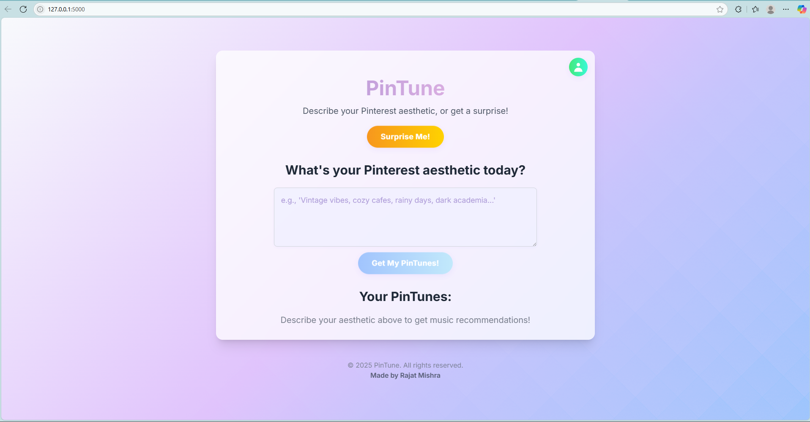
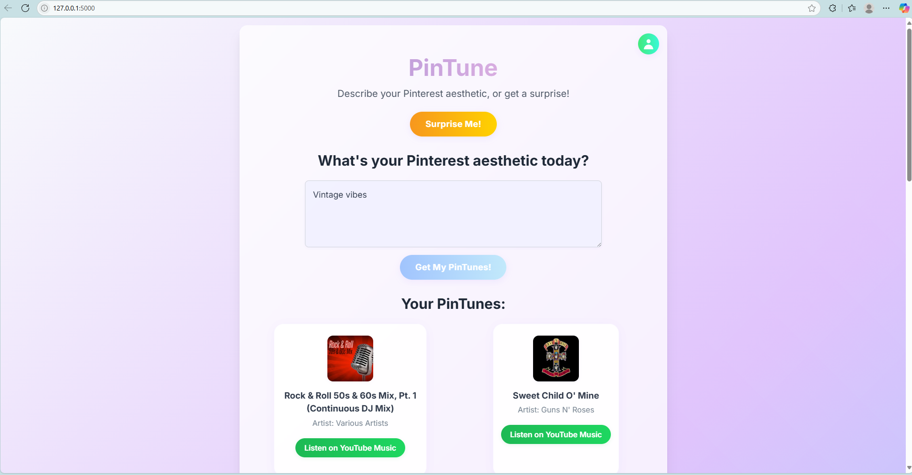
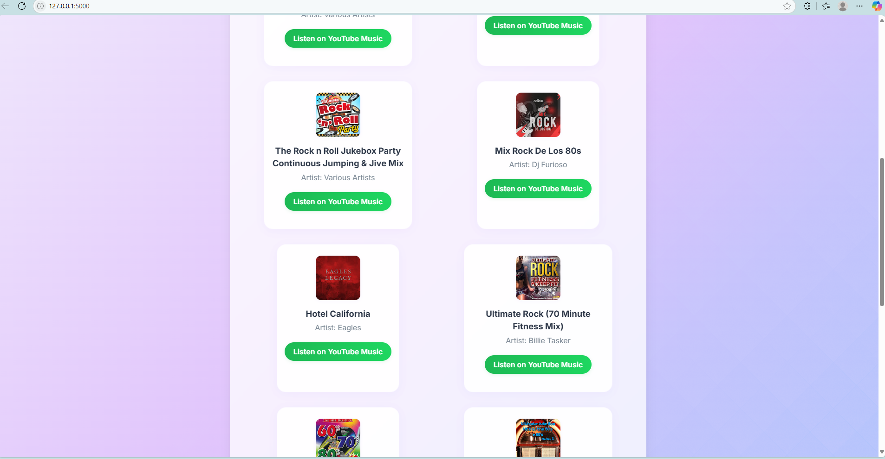
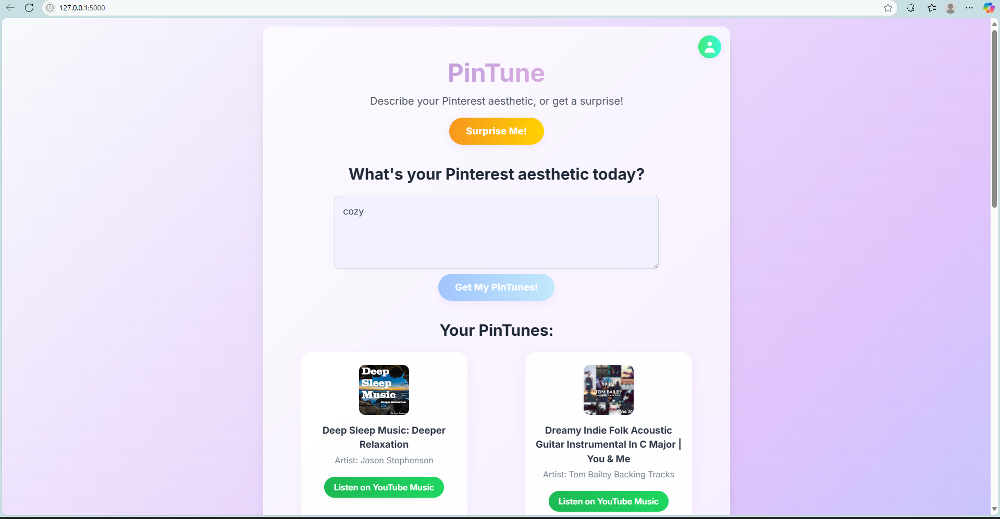
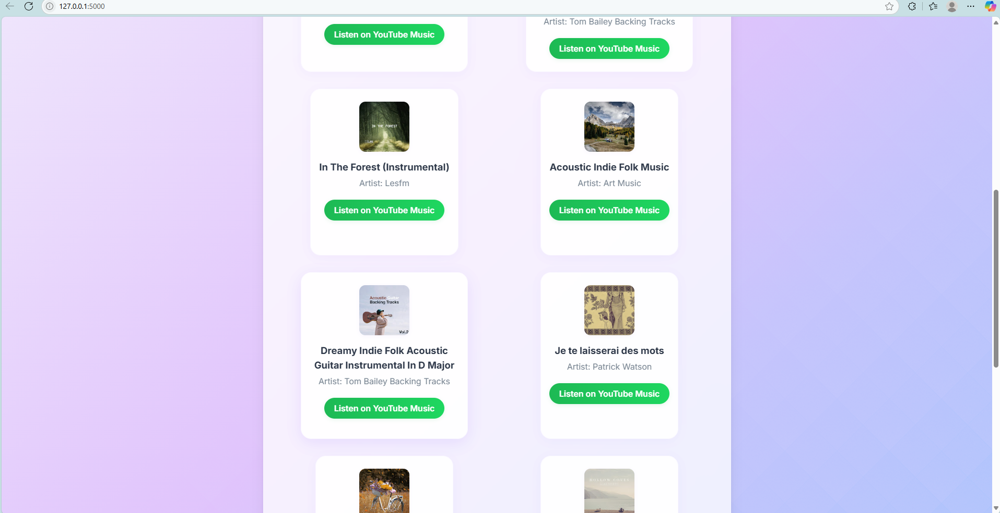
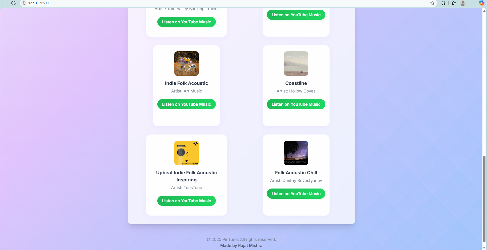
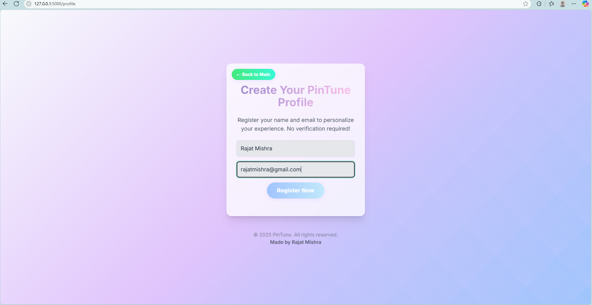

# PinTune 🎵

**PinTune** is a Pinterest-aesthetic-based music recommendation web app.  
Describe your mood or aesthetic, and get instant music suggestions from YouTube Music—no database required!

---

## 🌟 Features

- Describe your Pinterest mood (e.g., "cozy indie", "vintage pop", "dark academia")
- Get fresh, relevant music recommendations from YouTube Music
- Modern, responsive UI (Tailwind CSS)
- Profile registration (for future personalization)
- Easy to deploy and share

---

## 🚀 Screenshots










---

## 🛠️ Getting Started

### 1. Clone the Repo
git clone https://github.com/rajatmishra1809/PinTune.git
cd PinTune


### 2. Install Requirements
pip install Flask ytmusicapi


### 3. Run the App
python app.py

Visit [http://localhost:5000](http://localhost:5000) in your browser.

---

## 🌍 Share Your App Globally

To share your local server with friends:

- **Recommended:** Use [localhost.run](https://localhost.run/)
    ```
    ssh -R 80:localhost:5000 localhost.run
    ```
    Share the generated URL!

- **Or use ngrok:**  
    Download from [ngrok.com](https://ngrok.com/download), then:
    ```
    ngrok http 5000
    ```

---

## 📦 Project Structure

PinTune/
├── app.py
├── requirements.txt
├── static/
│ ├── css/
│ │ └── style.css
│ └── js/
│ ├── script.js
│ └── profile.js
├── templates/
│ ├── index.html
│ └── profile.html
└── screenshots/
├── 1.png
├── 2.png
├── 3.png
├── 4.png
├── 5.png
├── 6.png
├── 7.png
└── 8.png

---

## ✨ Credits

- Built by **Rajat Mishra**
- Music search powered by [ytmusicapi](https://ytmusicapi.readthedocs.io/)
- UI inspired by Pinterest & Tailwind CSS

---

## 📄 License

&copy; {{ 2025 }} PinTune. All rights reserved.  
Made by Rajat Mishra.

---


